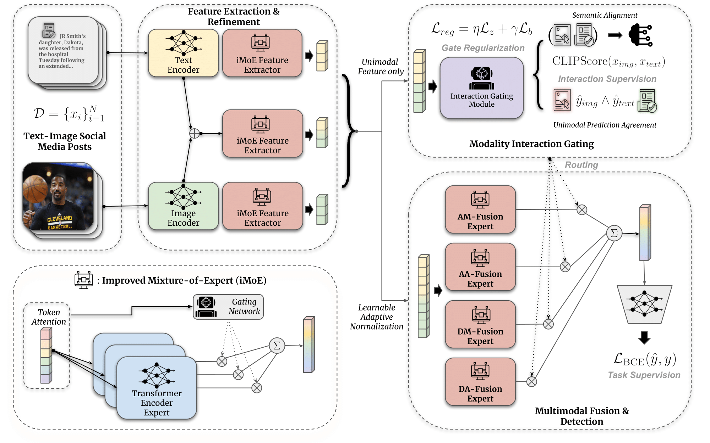
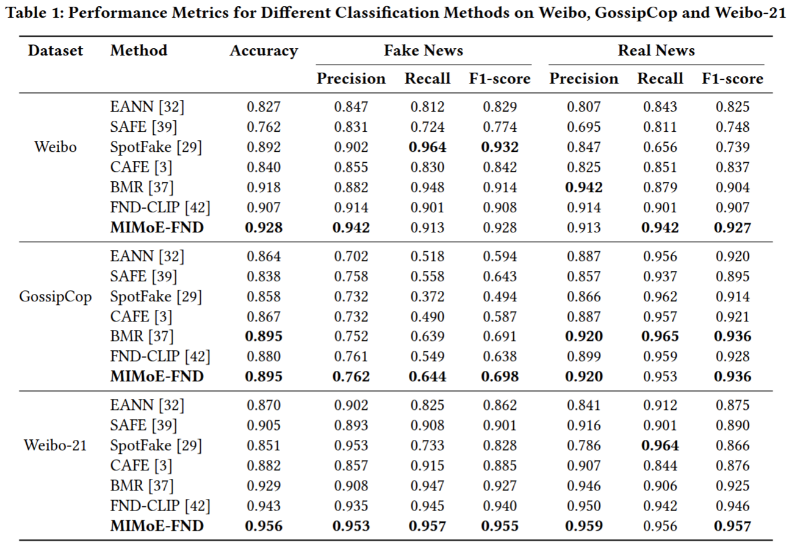

# Modality Interactive Mixture-of-Experts for Fake News Detection
PyTorch implementation for WWW 2025 paper: [Modality Interactive Mixture-of-Experts for Fake News Detection](https://arxiv.org/pdf/2501.12431).




# Data
We follow the same data preprocessing pipeline of [Bootstrapping Your Own Representations for Fake News Detection](https://github.com/yingqichao/fnd-bootstrap.git). Please use the data prepare scripts provided in `preprocessing` or the preprocessing scripts in [prior work](https://github.com/yingqichao/fnd-bootstrap/tree/master/data_preprocess) to prepare data for each datasets. For all datasets (Weibo/Weibo-21/GossipCop), please download from the official source.

# Pretrained Visual Encoder
The pre-training models of MAE can be downloaded from [Masked Autoencoders: A PyTorch Implementation](https://github.com/facebookresearch/mae.git). Because of the restriction on upload size, we are unable to upload pretrained models and the processed data. We will further open-source them on GitHub after the anonymous reviewing process.


# Training and Inference
We provide the training & inference commands in `train_vimoe.sh`, our trained checkpoints can be found at `./checkpoints` folder. After fixing the local paths in the bash provided bash file, run the scripts using.

`sh train_vimoe.sh`

After training or inference, the evaluation results will be automatically logged in a dataset-specific log file. The model checkpoints will be saved in the `checkpoint` folder.


# Performance


# Acknowledgement
During the implementation we base our code mostly on Transformers from HuggingFace and [BMR](https://github.com/yingqichao/fnd-bootstrap/tree/master/data_preprocess) by Qichao Ying. Many thanks to these authors for their great work!


# Cite
Please consider citing the following papers if you use our methods/code in your research:
```
@article{liu2025modality,
  title={Modality Interactive Mixture-of-Experts for Fake News Detection},
  author={Liu, Yifan and Liu, Yaokun and Li, Zelin and Yao, Ruichen and Zhang, Yang and Wang, Dong},
  journal={arXiv preprint arXiv:2501.12431},
  year={2025}
}
```
